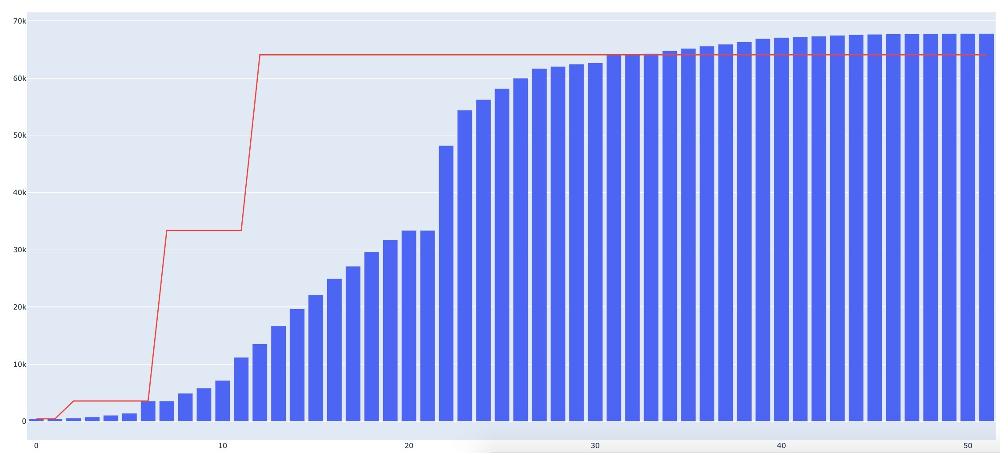
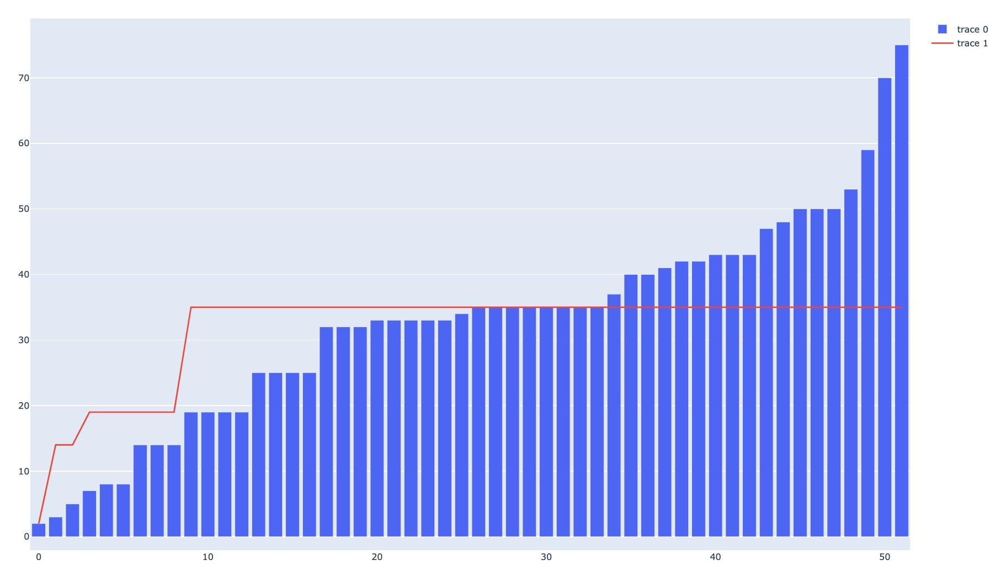

# COVID-19-model
## Machine learning-based logistic regression for confirmed COVID-19 cases that predicts carrying capacity of coronavirus (when coronavirus infections will stop) in a given region

• blue bar graph represents actual cases  
• red line graph represents logistic regression model (predicts coronavirus' carrying capacity)  

Model of Hubei, China's COVID-19 Cases

Model of Thailand's COVID-19 Cases

Confirmed COVID-19 Cases Dataset Source
https://github.com/CSSEGISandData/COVID-19/tree/master/csse_covid_19_data/csse_covid_19_time_series
